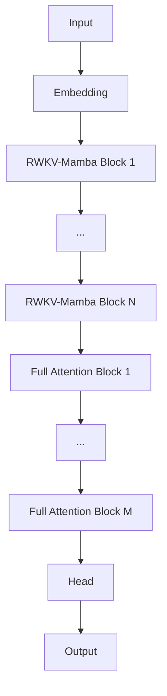

# open-i3

A novel hybrid language model combining RWKV time-mixing, Mamba state-space dynamics, and standard Multi-Head Attention for efficient training on consumer hardware.

**Feel free to contribute!** 🚀

---

## What is i3?

The i3 architecture bridges the gap between fast linear-time RNNs and powerful quadratic-time Transformers using a smart hierarchical approach. By combining RWKV-Mamba hybrid blocks for local context with full attention layers for long-range reasoning, i3 delivers the speed of RNNs where you need it and the power of attention where it matters most.

### Architecture Overview



**Key Design Principles:**
- **Hybrid Recurrence**: Blends RWKV's `w_mix` decay with Mamba's A/B/C state-space matrices
- **Memory Optimized**: Streaming vocab building, intelligent caching, aggressive cleanup for consumer GPUs
- **Smart Tokenization**: Variable 2–3 character chunking with robust unknown token handling

---

## Available Models

| Model | Parameters | Architecture | Status | Link |
|-------|-----------|--------------|--------|------|
| **i3-80M** | 82.77M | 10 Hybrid + 6 Attention | ✅ Available | [Documentation](src/80m/) |
| i3-22M | 22.6M | 24 Hybrid | 🔒 Legacy | - |
| More coming soon... | - | - | 🚧 In Development | - |

---

## Quick Start

### Installation

```bash
# Clone the repository
git clone https://github.com/FlameF0X/open-i3.git
cd open-i3

# Install dependencies
pip install torch transformers wandb datasets numpy
```

### Choose Your Model

Each model has its own directory under `src/` with specific training and inference scripts:

- **i3-80M**: See [`src/80m/README.md`](src/80m/) for detailed instructions

### General Workflow

1. **Train a model**: Navigate to the model directory and run the training script
2. **Run inference**: Use the provided inference script with your trained model
3. **Fine-tune** (optional): Adapt the model to your specific use case

---

## Why i3?

### Efficient Training on Consumer Hardware
- GPU Utilization: 15–20%
- VRAM Usage: ~2-3GB
- Power Consumption: ~40W
- Speed: 100–550 tokens/sec

### Hybrid Architecture Benefits
- **Fast sequential processing** with RWKV-Mamba blocks
- **Powerful reasoning** with attention layers
- **Memory efficient** design for long sequences
- **Scalable** to larger model sizes

---

## Project Structure

```
open-i3/
├── src/
│   ├── 80m/              # i3-80M model (training + inference)
│   │   ├── train.py
│   │   ├── inference.py
│   │   └── README.md
│   └── [future models]/
├── LICENSE
└── README.md             # This file
```

---

## Citation

If you use i3 in your research, please cite the foundational work:

```bibtex
@article{mamba,
  title={Mamba: Linear-Time Sequence Modeling with Selective State Spaces},
  author={Gu, Albert and Dao, Tri},
  journal={arXiv preprint arXiv:2312.00752},
  year={2023}
}

@article{RWKV,
  title={RWKV: Reinventing RNNs for the Transformer Era},
  author={Peng, Bo and others},
  journal={arXiv preprint arXiv:2305.13048},
  year={2023}
}
```

---

## Contributing

Contributions are welcome! Whether you're:
- Adding a new model variant
- Improving training efficiency
- Fixing bugs
- Enhancing documentation

Feel free to open an issue or submit a pull request.

---

## License

This project is licensed under the Apache 2.0 License.

---

**Questions?** Open an issue on GitHub!

## Star History

<a href="https://www.star-history.com/#FlameF0X/open-i3&type=timeline&legend=bottom-right">
 <picture>
   <source media="(prefers-color-scheme: dark)" srcset="https://api.star-history.com/svg?repos=FlameF0X/open-i3&type=timeline&theme=dark&legend=bottom-right" />
   <source media="(prefers-color-scheme: light)" srcset="https://api.star-history.com/svg?repos=FlameF0X/open-i3&type=timeline&legend=bottom-right" />
   
 </picture>
</a>
