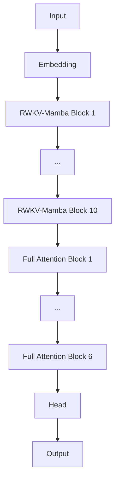

# open-i3 # Feel free to contribute :D

**open-i3** is the official repository for the i3 Hybrid Architecture, a novel approach to language modeling that combines the efficiency of RWKV time-mixing and Mamba state-space dynamics with the precision of standard Multi-Head Attention.

Designed for maximum training efficiency on consumer hardware, this repository contains the complete training pipeline used to create **i3-80M** — the second model in the i3 series, scaling up from the original i3-22M with improved architecture and multi-dataset training.

---

# The Architecture

The i3 architecture is designed to bridge the gap between linear-time RNNs and quadratic-time Transformers using a hierarchical approach:

## Layers 1–10: RWKV–Mamba Hybrid Blocks

Process local context and maintain state using linear interpolation and SSM dynamics.
Computationally cheap; efficient for temporal dependencies.

## Layers 11–16: Full Attention Blocks

Standard Multi-Head Attention for long-range dependencies and reasoning.

### Flow Diagram (Mermaid)



---

# Technical Innovations & Memory Optimization

### Hybrid Recurrence

Custom `RWKVMambaHybrid` module blending:

* `w_mix` decay (RWKV)
* A/B/C matrices (Mamba)

### Memory-Optimized Training

* **Streaming Vocabulary**: Build vocab without loading full text into RAM.
* **Caching**: Vocabulary is built once and reused.
* **Auto-Cleanup**: Aggressive intermediate cleanup to prevent OOM on consumer GPUs.
* **Smart Tokenization**: Variable-length chunking (2–3 chars), common trigrams, robust `<UNK>` handling.

---

# Model Statistics (i3-80M)

| Feature                     | Specification                  |
| --------------------------- | ------------------------------ |
| Total Parameters            | ~82.77M                        |
| Architecture                | 10 Hybrid + 6 Attention Layers |
| Context Window              | 256 tokens                     |
| Hidden Dim (`d_model`)      | 512                            |
| Heads                       | 16                             |
| State Dimension (`d_state`) | 32                             |
| Vocabulary                  | 35,560                         |
| Tokenization                | 2–3 character chunking         |

---

# Comparison: i3-22M vs i3-80M 
## Using data from [i3-80](https://huggingface.co/FlameF0X/i3-80m)-- your run might vary base on dataset(s) and configuration(S)

| Feature          | i3-22M     | i3-80M                                |
| ---------------- | ---------- | ------------------------------------- |
| Parameters       | 22.6M      | 82.77M                                |
| Architecture     | 24 Hybrid  | 10 Hybrid + 6 Attention               |
| Hidden Dim       | 512        | 512                                   |
| Vocab Size       | 4,466      | 35,560                                |
| Training Data    | TinyChat   | TinyStories + TinyChat + HQ Sentences |
| Total Tokens     | ~1M convos | ~3M+                                  |
| Final Loss       | ~2.0       | ~2.0                                  |
| Perplexity       | 7.29–9.70  | 7.29–10.0                             |
| Training Time    | ~17 hours  | ~2–4 hours                            |
| Attention Layers | None       | 6 Full Attention                      |

### Key Improvements

* Hybrid + full attention
* Larger vocabulary
* Multi-dataset training

---

# Training Details
## Using data from [i3-80](https://huggingface.co/FlameF0X/i3-80m)-- your run might vary base on dataset(s) and configuration(S) but this is the default.

**Configuration**

* **Datasets**:
  `agentlans/high-quality-english-sentences`,
  `roneneldan/TinyStories`,
  `starhopp3r/TinyChat`
* **Steps**: 5,000
* **Batch Size**: 4
* **Learning Rate**: 3e-4 (warmup + cosine)
* **Optimizer**: AdamW (clip norm 1.0)
* **Hardware**: NVIDIA P100 (16GB)
* **Framework**: PyTorch

**Efficiency**

* GPU Utilization: ~15–20%
* VRAM: ~2.2GB allocated (peak ~18% of 12GB)
* Power: ~40W
* Throughput: ~100–550 tokens/sec

**Performance**

| Metric        | Initial | Final |
| ------------- | ------- | ----- |
| Training Loss | ~10.0   | ~1.7  |
| Perplexity    | ~4000+  | ~6    |

> **NOTE**
> THIS IS FROM THE MODEL PUBLISHED ON HUGGINGFACE https://huggingface.co/FlameF0X/i3-80m

---

# Training from Scratch

### Clone repository

```bash
git clone https://github.com/FlameF0X/open-i3.git
cd open-i3
```

### Install dependencies

```bash
pip install torch transformers wandb datasets numpy
```

### Optional: enable WandB

```bash
export WANDB_API_KEY="your_key_here"
```

### Run training

```bash
python src/80m/train.py
```

---

# Limitations

* English-only training
* 256-token context window
* May require fine-tuning for specific tasks
* Conversational style influenced by TinyChat

---

# Model Files

* `pytorch_model.bin`: weights
* `config.json`: configuration
* `chunk_vocab_combined.json`: tokenizer vocab

---

# Citation

```
@article{mamba,
  title={Mamba: Linear-Time Sequence Modeling with Selective State Spaces},
  author={Gu, Albert and Dao, Tri},
  journal={arXiv preprint arXiv:2312.00752},
  year={2023}
}

@article{RWKV,
  title={RWKV: Reinventing RNNs for the Transformer Era},
  author={Peng, Bo and others},
  journal={arXiv preprint arXiv:2305.13048},
  year={2023}
}
```

---

# License

Apache 2.0 License.

If you want a more compact version, a table-of-contents version, or GitHub-ready formatting, specify and I will generate it.
